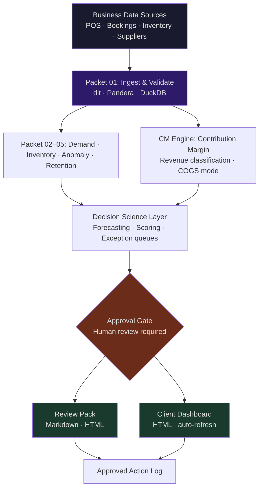

# AI Pipeline Systems

Modular AI operational systems for small and medium businesses. Built to convert raw business data into daily decisions — without requiring a data team.

---

## What This Is

A showcase of the methodology, architecture, and workflow I use to build AI pipeline systems for SMB clients. This repo documents the thinking and structure behind the builds — not proprietary client code.

The core idea: most SMBs are sitting on operational data they never act on. A well-designed pipeline surfaces that data as structured, approval-gated intelligence.

Client repos are private. This repo documents the reusable methodology.

---

## Architecture Overview



**Data flows in. Decisions go through a human. Approved actions flow out.**

---

## Pipeline Stages

Every client system follows the same 8-stage shape:

| Stage | What happens |
| --- | --- |
| **Raw** | Source data landed as-is, no modification |
| **Validation** | Schema checks, freshness flags, import log, missing sources list |
| **Clean** | Standardised dates, values, statuses — source traceability preserved |
| **Mapping** | Source names → canonical entities, unmapped queue, confidence scored |
| **Aggregation** | Daily totals, rolling averages, period comparisons |
| **Model** | Business logic applied — forecasting, scoring, classification |
| **Output** | Review pack, exception queue, dashboard |
| **Approval** | Human reviews, signs off, logs decision + reason |

---

## SMB Verticals

| Vertical | Primary Sources | Key Outputs |
| --- | --- | --- |
| Restaurant | Square POS, ResOS bookings | Revenue forecasting, no-show scoring, contribution margin |
| Retail | EPOS, inventory system | Stock reorder triggers, slow-mover alerts, margin by SKU |
| Salon / Beauty | Booking platform | Stylist utilisation, rebooking gaps, at-risk clients |
| Gym / Fitness | Membership, class attendance | Churn risk scoring, capacity optimisation |
| Trades | Job management, invoicing | Job profitability, quote conversion, invoice overdue alerts |
| E-commerce | Orders, returns, ad spend | ROAS by channel, product margin, fulfilment flags |

**Validated on real client data:** Restaurant (Nok Nok, Mumbles — Client 001)

---

## Automation Tiers

Not all automation is equal. Every client system uses a tiered model with hard approval boundaries:

| Tier | Capability | Status |
| --- | --- | --- |
| 0 | Manual checklists, human review | Active — all decisions |
| 1 | AI drafts, summaries, file organisation | Active |
| 2 | Schema validation, freshness checks, exception queues | Active |
| 3 | Mapping suggestions, anomaly notes, priority queues | Active |
| 4 | Read-only integrations — fetch, compare, monitor | Active |
| 5 | Approved writes — draft reports, internal updates | Active |
| 6 | Business-critical automation | Deferred until trust proven |

**Hard rule:** Agents prepare. Humans approve. Tier 6 only when governance is mature.

---

## Development Workflow

```text
Plan → Spec → Build → Gate → Review → Approve → Ship
```

| Phase | Tool | Purpose |
| --- | --- | --- |
| Plan | OpenAI Codex | Spec every task, generate implementation steps |
| Build | Claude Code | Implement inside repo with persistent CLAUDE.md context |
| Version control | GitHub (branch-per-task) | Every feature isolated, clean history |
| Validation | dlt · Pandera | Schema validation, source contract enforcement |
| Local storage | DuckDB | Analytical queries without infrastructure |
| Automation | n8n (Docker) | Workflow orchestration — refresh, digest, alert |
| Client interface | Notion · HTML dashboards | Review packs, approval logs, status views |

Full methodology: [docs/methodology.md](docs/methodology.md)

---

## Stack

- **AI**: Claude (Anthropic), OpenAI Codex
- **Language**: Python
- **Data validation**: dlt, Pandera
- **Local analytics**: DuckDB
- **Automation**: n8n (self-hosted via Docker)
- **Version control**: GitHub
- **Client interface**: Notion, static HTML dashboards
- **Internal operations**: Claude Cowork (team plan)

---

## Repo Structure

```text
ai-pipeline-systems/
├── README.md                     # This file
├── CLAUDE.md                     # Persistent AI context for this repo
├── docs/
│   ├── methodology.md            # Plan → build → approval workflow
│   ├── architecture.md           # 8-stage pipeline breakdown
│   └── verticals.md              # Vertical-specific implementation notes
└── templates/
    ├── CLAUDE.md.template        # Starting context file for new client projects
    └── client-brief.md           # Client scoping and onboarding document
```

---

## Templates

- [CLAUDE.md template](templates/CLAUDE.md.template) — persistent AI context file for any new project
- [Client brief template](templates/client-brief.md) — scoping, data inventory, output definition

---

## About

I build AI operational systems for SMBs that want their data to actually work for them. Every engagement starts with a data audit, moves through a structured V1 delivery, and scales into a recurring operational loop.

Methodology-first: every task is planned before a line of code is written, every data source has a contract before any logic runs on it, and every model output goes through a human approval gate before it reaches the client.

---

*Client work is private. This repo documents the methodology and architecture behind it.*
