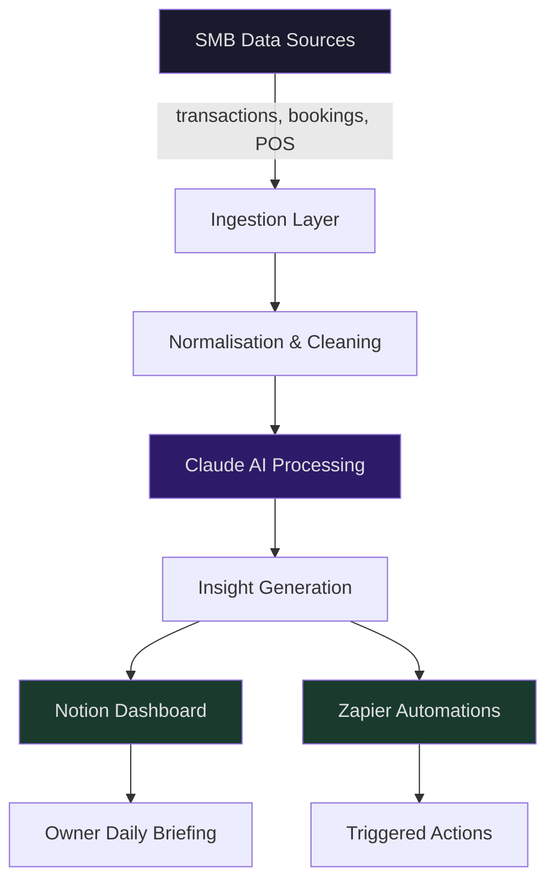

# AI Pipeline Systems

Modular AI data pipeline architecture for small and medium businesses. Built to convert raw operational data into daily decisions — without requiring a data team.

---

## What This Is

A showcase of the methodology, architecture, and workflow I use to build AI pipeline systems for SMB clients. This repo documents the thinking and structure behind the builds — not proprietary client code.

The core idea: most SMBs are sitting on valuable operational data they never act on. A well-designed pipeline surfaces that data as actionable daily intelligence.

---

## Architecture Overview



**Data flows in. Decisions flow out.**

---

## SMB Verticals

| Vertical | Primary Data Source | Key Output |
|---|---|---|
| Restaurant | POS, reservation system | Menu performance, staff scheduling |
| Retail | Sales, inventory | Reorder triggers, slow-stock alerts |
| Salon / Beauty | Booking platform | Rebooking gaps, stylist utilisation |
| Gym / Fitness | Membership, class attendance | Churn risk, capacity optimisation |
| Trades | Job management, invoicing | Job profitability, quote conversion |
| E-commerce | Orders, returns, ad spend | ROAS, product margin, fulfilment flags |

---

## Development Workflow

```
Plan → Build → Review → Ship → Monitor
```

| Phase | Tool | Purpose |
|---|---|---|
| Plan | OpenAI Codex | Spec every task, generate implementation steps |
| Build | Claude Code | Implement spec inside repo with persistent context |
| Version Control | GitHub (branch-per-task) | Every feature isolated, clean history |
| Context | CLAUDE.md | Persistent project memory across sessions |
| Command Hub | Notion | Client briefs, task tracking, deliverable log |
| Automation | Zapier | Connect pipeline outputs to client workflows |

Full methodology detail: [docs/methodology.md](docs/methodology.md)

---

## Stack

- **AI**: Claude (Anthropic), OpenAI Codex
- **Languages**: Python
- **Version Control**: GitHub
- **Automation**: Zapier
- **Client Interface**: Notion
- **Data Sources**: POS systems, booking platforms, e-commerce APIs, spreadsheet exports

---

## Repo Structure

```
ai-pipeline-systems/
├── README.md                  # This file
├── CLAUDE.md                  # Persistent AI context (see templates/)
├── docs/
│   ├── methodology.md         # How I plan and build pipeline systems
│   ├── architecture.md        # Pipeline component breakdown
│   └── verticals.md           # SMB vertical implementation notes
└── templates/
    ├── CLAUDE.md.template     # Starting point for new client projects
    └── notion-brief.md        # Client briefing document template
```

---

## Templates

Reusable starting points for new engagements:

- [CLAUDE.md template](templates/CLAUDE.md.template) — persistent AI context file for any new project
- [Notion brief template](templates/notion-brief.md) — client onboarding and brief structure

---

## About

I build AI pipeline systems for SMBs that want their operational data to actually work for them. Engagements run from initial data audit through to live pipeline with client-facing Notion dashboard.

Built with a methodology-first approach: every project is planned before a line of code is written, every task is isolated on its own branch, and every session runs with persistent AI context via CLAUDE.md.

---

*Client work is private. This repo documents the methodology and architecture behind it.*
